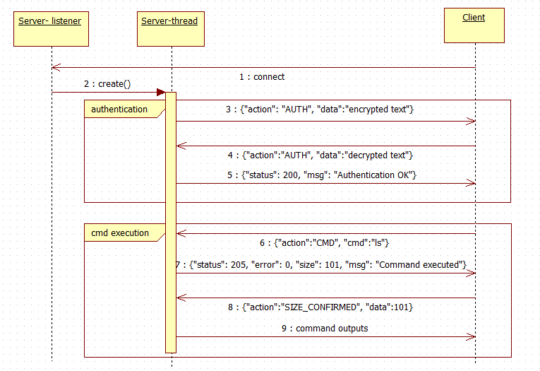

simple TCP Server/Client model to simulate ssh
==============================

Table of Contents
+ 
+ 
+ 
    + 
    + 

## porpuse
just for network programming exercice, don't report bug for me ^_^

## preparation
1. install required module, e.g. pycryptodome
    ```
    pip install -r equirements.txt
    ```
1. generate RSA key pair: id_rsa (priviate key) and  id_rsa.pub (public key)
    ```
    ssh-keygen -t rsa -C
    ls ~/.ssh
    $ authorized_keys  id_rsa  id_rsa.pub  known_hosts
    ```
1. register public key to ~/.ssh/authorized_keys in remote host
    ```
    ssh-copy-id -i id_rsa.pub root@192.168.56.111
    ```

## sequence diagram


## example
### server
```
# ./ssh_server.py 
Server is running on port 54321; press Ctrl-C to terminate.

[192.168.56.111:53596] connected
[192.168.56.111:53596] generate password: ':?m/d=9\\'
[192.168.56.111:53596] recv: b'{"data": ":?m/d=9\\\\", "action": "AUTH"}'
[192.168.56.111:53596] send: {'msg': 'Authentication OK', 'status': 200}
[192.168.56.111:53596] recv: b'{"cmd": "ls", "action": "CMD"}'
[192.168.56.111:53596] cmd output: b'1024.txt\n2048.txt\n2050.txt\n4096.txt\nindex.html\nssh_client.py\nssh_serve' ...
[192.168.56.111:53596] send: {'size': 101, 'msg': 'Command executed', 'error': 0, 'status': 205}
[192.168.56.111:53596] recv: b'{"data": 101, "action": "SIZE_CONFIRMED"}'
[192.168.56.111:53596] cmd done: sent 101 bytes

```
### client
```
# ./ssh_client.py 192.168.56.111 54321
>> ls
1024.txt
2048.txt
2050.txt
4096.txt
index.html
ssh_client.py
ssh_server.py
```