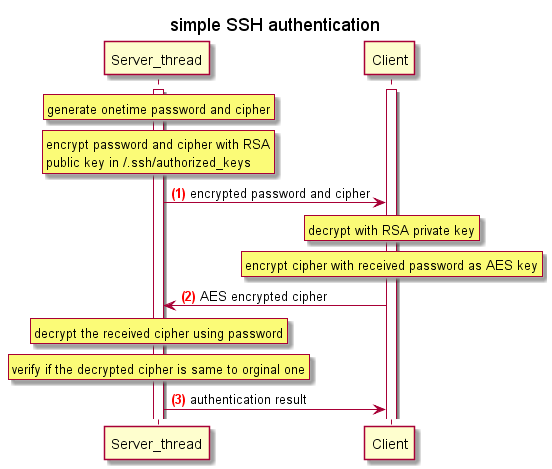

simple TCP Server/Client model to simulate ssh
==============================

Table of Contents
+ [porpuse](#porpuse)
+ [preparation](#preparation)
+ [sequence diagram](#sequence-diagram)
    + [overview](#overview-sequence)
    + [authentication](#authentication-sequence)
+ [example](#example)
    + [server](#server)
    + [client](#client)

## porpuse
simulate simple ssh, just for network programming exercice, please don't report bug to me ^_^

## preparation
1. requires Python 3.5 or newer version
1. requires 3rd-party modules, e.g. pycryptodome
    ```
    pip install -r equirements.txt
    ```
1. generate RSA key pair: id_rsa (priviate key) and  id_rsa.pub (public key)
    ```
    ssh-keygen -t rsa -C
    ls ~/.ssh
    $ authorized_keys  id_rsa  id_rsa.pub  known_hosts
    ```
1. register public key to ~/.ssh/authorized_keys in remote host
    ```
    ssh-copy-id -i id_rsa.pub root@192.168.56.111
    ```

## sequence diagram
### overview sequence

### authentication sequence


## example
### server
``` bash
# ./ssh_server.py 
Server is running on port 54321; press Ctrl-C to terminate.
2018-05-20 20:37:12 [192.168.56.111:40068] connected
2018-05-20 20:37:12 [192.168.56.111:40068] generate password: 'L;X;;#8l' cipher: 'RoOKVfkj'
2018-05-20 20:37:13 [192.168.56.111:40068] send msg: b'{"data": "aApMGuszUnaqwLmPuWsUyY8+Th25ncWVdaOSC8AuGbb42OtLFLEjvREGLGd7nbukX4ZM8WdyjqyvEuZFhNhr6hyZyYgzMgaVgzEKmh25iQG4qXaClB4codiMJZOmcp59JI5QBpbWKCuFV0gtOTvkZiM6aOCze6/mSs2jaZ5Zy9ooWdXiK4p4h0zlGS/pFiC7/XHa8i3aGbCKhYUUrEuqWGsV4HgdXX8vubyMLVX3PwY7weU0riB4d9iNJuVUbF6CTszIBdfTcCqUIplfrsgWPjCo3+jAU58L3fhdbOChZyhYaBsyoh3aw1PQDdM0Jmmo5+JrYYX6flGzh+9lVMvnHQ==", "cipher": "NNIbLKAmUrNgv666OXRelurKVFBIXe9rblTtJT/yVbIWPhbP7V9Ohupszbsdx958lQQ8NpEk+T4ovbmHKcZA1/TwMug+t5BVWSC404TLvL1Hfd5U0TwUNuVVjl+RM/mZy60VLl9+BxXeymGBjy1pStKVJ5GJCJphJmmqHSzO+BjQ2kQ4smSvOAD/ne/yu9kj30TKTrzDXNgJt1bmH7EsfISSvRcYL8W6TGNz2ut7TDCtu63PIlYvc7rNlL9ZZHSDVhfMppZ+icuB3/L7hxfuNaft+AWfJlyanBacgb3qe7Lp8nXwxoCCz3Bad1bNRikh01bVgpsvfAWakmfwy4Qptg==", "action": "AUTH"}'
2018-05-20 20:37:13 [192.168.56.111:40068] recv msg: b'{"action": "AUTH", "data": "Bg8kE8bdXRyuHQRA7ftvIg=="}'
2018-05-20 20:37:13 [192.168.56.111:40068] send msg: b'{"msg": "Authentication OK", "status": 200}'
2018-05-20 20:37:18 [192.168.56.111:40068] recv msg: b'{"action": "CMD", "cmd": "ls"}'
2018-05-20 20:37:18 [192.168.56.111:40068] send msg: b'{"msg": "Command executed", "output": "docs\\nencrypt.py\\nmsg.py\\n__pycache__\\nREADME.md\\nrequirements.txt\\nseq_authentication.png\\nseq_overview.png\\nsequence.uml\\nssh_client.py\\nssh_server.py\\ntests\\n", "error": 0, "status": 205}'

```
### client
``` bash
# ./ssh_client.py 192.168.56.111 54321
[192.168.56.111:50456]
Authentication OK
>> ls
README.md
requirements.txt
sequence_diagram.png
sequence.uml
ssh_client.py
ssh_server.py

>> 

```
